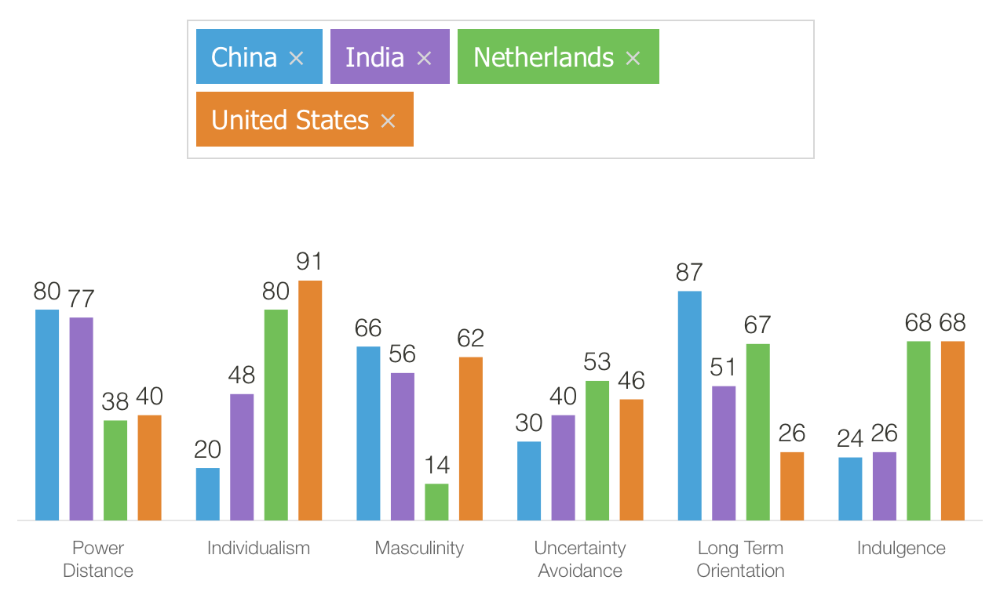
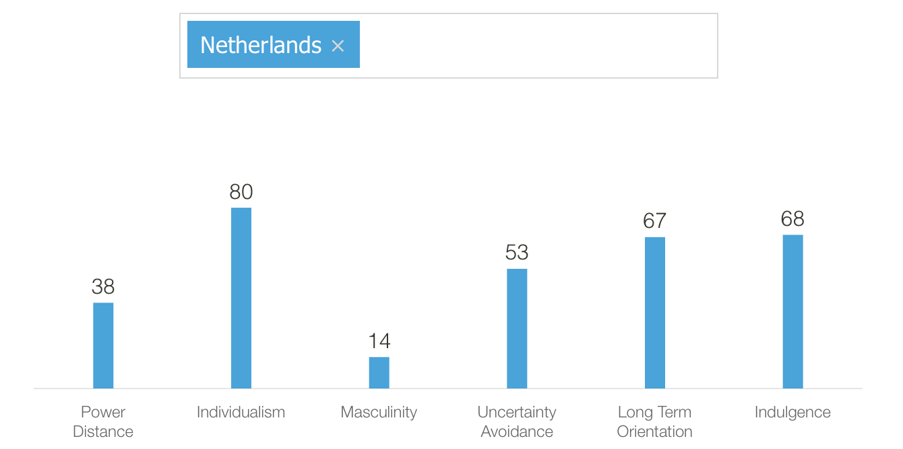

<h1 align="center">Semester 3<br/>Portfolio</h1>
<h3 align="center">Bart Lamers</h3>
<br/>

<p align="center"></p>

# Inhoudsopgave
* [1. Introductie](#1-introductie)
* [2. Leeruitkomsten](#2-leeruitkomsten)
  * [2.1 Web applicatie](#21-web-applicatie)
  * [2.2 Software kwaliteit](#22-software-kwaliteit)
  * [2.3 Agile methode](#23-agile-methode)
  * [2.4 CI/CD](#24-cicd)
  * [2.5 Culturele verschillen en ethiek](#25-culturele-verschillen-en-ethiek)
  * [2.6 Requirements en design](#26-requirements-en-design)
  * [2.7 Business processen](#27-business-processen)
  * [2.8 Professioneel](#28-professioneel)
* [3. Reflectie](#3-reflectie)
* [Bronvermelding](#bronvermelding)

# 1. Introductie
In dit document beschijf ik de leeruitkomsten van semester 3 en hoe ik deze heb aangetoond.<br/>
Ook kijk ik middels een reflectie terug op dit semester wat ik heb geleerd en wat ik daarvan meeneem naar semster 4.


# 2. Leeruitkomsten
## 2.1 Web applicatie
```
Je ontwerpt en bouwt gebruiksvriendelijke, full-stack webapplicaties.

Gebruiksvriendelijk: Je past basistechnieken voor het testen en ontwikkelen van gebruikerservaringen toe.

Full-stack: Je ontwerpt en bouwt een full-stack applicatie met behulp van algemeen aanvaarde front-end (Javascript-gebaseerd framework) en back-endtechnieken (bijv. Object Relational Mapping), waarbij je relevante communicatieprotocollen kiest en implementeert en problemen met asynchrone communicatie aanpakt.
```
<details>
<summary><b>Hoe heb ik deze leeruitkomst aangetoond</b></summary>

####
<details>
<summary><b>Individueel project (Chefresh)</b></summary>

### 2.1.1 Project beschrijving
Chefresh is een app die is ontwikkeld in C# met gebruik van een minimale API-backend en een ReactJS-frontend.

Doel van de app: <br/>
Chefresh: de revolutionaire inventarisatie-app waarmee u uw producten in huis kunt bijhouden op houdbaarheidsdatum!
Zo kom je nooit meer voor verrassingen in de koelkast te staan en bereid je de lekkerste gerechten met etenswaren die het snelst genuttigd moeten worden.
Wel zo fijn voor onze planeet 🌍

### 2.1.4 Minimal-API of REST-API?
Chefresh versie 1 is een MVC-applicatie met 3-lagen structuur.
Dit was nodig om de leeruitkomsten uit semester 2 aan te tonen.
Nu wil ik de Chefresh app verder optimaliseren en ga ik een API maken die met een losse front-end communiceerd.
Hiervoor heb ik onderzoek gedaan naar een minimal API (zonder controllers) of een standaard API (met controllers) zie 2.1.6

### 2.1.5 Front-end
De front-end van Chefresh is gemaakt in ReactJS i.c.m. bootstrap voor react.
Ik had nog nooit eerder gewerkt met ReactJS dus het was een hele uitdaging om de web-app op de juiste manier te laten functioneren.
In de frond-end maak ik gebruik van Axios voor het versturen van calls naar de back-end.

In het begin liep ik tegen het probleem van cross-origin aan en dat mijn front-end daardoor niet kon communiceren met de back-end.
Na wat aanpassingen in de back-end was dit probleem ook verholpen.

### 2.1.6 Back-end
Ik heb dit semester opnieuw gekozen voor een backend in C# (.Net6).
In het 2e semester heb ik ook al met C# (.Net6) gewerkt met een MVC-versie van Chefresh.
Omdat ik me meer wilde verdiepen in C# heb ik niet gekozen voor een standaard REST-API met controllers aangezien dit te makkelijk zou zijn met het ombouwen van de MVC-applicatie naar een API.
Daarom heb ik gekozen voor een minimal-API, een API zonder controllers waarbij de endpoints worden aangemaakt in de program.cs.

Omdat Chefresh voornamelijk bestaat uit CRUD-acties heeft een minimal-API als voordeel dat het compacter is dan een standaard-API.
Het was wel even zoeken hoe een minimal-API werkt omdat de documentatie en implementatie er van nog niet zo breed bekend is als de standaard versie van een API.

Gaandeweg ben ik er achter gekomen dat naast de voordelen die een minimal-API met zich mee brengt er ook nadelen zijn.
Zo is het niet mogelijk om een cookie aan te maken in een endpoint, maar uitsluitend in de middleware.
Hierdoor heb ik de JWT-token niet als httpOnly-cookie kunnen meesturen en moest ik de token opslaan in de localstorage van de browser.
Meer hierover heb ik beschreven in mijn onderzoek naar veiligheid.

### 2.1.7 Hoe kan ik mijn api beveiligen tegen ongeautoriseerde toegang?
Om dit uit te zoeken heb ik onderzoek gedaan naar welke manieren er mogelijk zijn om mijn API zo goed mogelijk te beveiligen tegen ongeautoriseerde toegang.
Middels dit onderzoek ben ik er achter gekomen dat er erg veel manieren zijn om een API beter te beveiligen.

```
DOT-Framework:
- Community research
- Best good and bad practices
```

### 2.1.8 Welke manieren zijn er?
Allereerst kwam ik in het onderzoek tegen dat en verschillende design principles zijn voor het bouwen van een API.
Hierdoor kwam ik er achter dat ik een gedeelte van die principles al heb toegepast.
[https://restfulapi.net/security-essentials/]
[https://www.f5.com/labs/learning-center/securing-apis-10-best-practices-for-keeping-your-data-and-infrastructure-safe]

Denk aan:

**SSL/TSL:**
Mijn applicatie zowel front-end als back-end maken gebruik van SSL,
hierdoor is de informatie die tussen de API en client worden verstuurd versleuteld.

**Wachtwoord hashing:**
De wachtwoorden in mijn app worden gehashed opgeslagen.
Dit voorkomt dat wachtwoorden leesbaar worden opgeslagen in de database.

**Hou het simpel:**
Ik heb geen onnodige end-points of extra moeilijke end-points gemaakt. Het doel is en blijft een CRUD applicatie.
Het onnodig moeilijk maken van een end-point kan ook de beveiliging schaden.

**Geef nooit informatie over URL's vrij:**
In de URL's staan geen data zoals wachtwoorden, gebruikersnamen, emailadressen etc.
Alles wordt uitsluitend via de body meegestuurd van de front-end naar de back-end.

**Validatie op invoerparameters:**
Er vind valitatie op de invoer plaats. Als een gebuiker verkeerde data invoerd krijgt de frond-ent ook een juiste status terug van de back-end.
Het is ook onmogelijk om een verzoek te doen als de parameters niet kloppen.

Daarnaast zijn er extra mogelijkheden om een API beter te beveiligen.

Zoals: **OAuth** en **Jason Web Token (JWT)**

### 2.1.9 Wat is OAuth?
"OAuth (Open Authorization) - vaak geschreven als de nieuwste versie OAuth 2.0 - is een protocol dat wordt gebruikt om een gebruiker te authenticeren via een authenticatieserver.

Een van de handige dingen van OAuth is dat u accounttoegang op een veilige manier kunt delegeren zonder inloggegevens te delen.
In plaats van inloggegevens vertrouwt OAuth op toegangstokens.

Met behulp van toegangstokens kan een clienttoepassing de identiteit verifiëren van de gebruiker die zichzelf heeft geverifieerd." [https://supertokens.com/blog/oauth-vs-jwt#]

**Voordelen van OAuth:**

- Het is een industrie standaard voor authenticatie.
- Er zijn veel plug-en-play opties voor implementatie.
- OAuth is bewezen veilig en veel getest.
- OAuth kan gebruikt worden met bijna alle codeer-talen.

**Nadelen van OAuth:**

- OAuth is erg gecompliceerd.
- Lagere end-user privacy (denk aan de autnenticatie via een google server).
- In sommige applicaties is het over-kill.
- Geen sessie-mangement oplossing.

### 2.1.10 Wat zijn JWT-Tokens?
"Een JWT is een token dat wordt gegenereerd door de authenticatieserver en de informatie van de eindgebruiker bevat (zoals gebruikers-ID, e-mail, enz.).
De informatie is in JSON-indeling en kan efficiënt worden geverifieerd door de client met behulp van cryptografie." [https://supertokens.com/blog/oauth-vs-jwt#]

**Voordelen van JWT-Tokens:**

- JWT zijn opzichzelf staand.
- JWT biedt sterke veiligheidsgaranties.
- JWT's worden alleen op de client opgeslagen.
- Ze zijn efficiënt en snel te verifiëren.

**Nadelen van JWT-Tokens:**

- Je kunt JWT's niet intrekken zonder veel extra technische implentatie, denk aan blacklisting.
- Het is gemakkelijk om beveiligings lekken te creëren terwijl je één geheim veilig houdt.

### 2.1.11 Welke manieren zijn er om JWT-tokens te bewaren?
Voor mijn project wil ik gebruik gaan maken van JWT-tokens voor authenticatie.
Deze tokens moeten ergens worden opgeslagen, dit kan echter op verschillende manieren.
Dit ben ik verder gaan uitzoeken middels onderzoek.
Iedere manier heeft namelijk zijn voor- en zijn nadelen en deze ga ik behandelen.

**LocalStorage:**
Het opslaan van de JWT-token in localStorage heeft als voordeel dat het makkelijk toegankelijk is via JavaScript en dus daardoor gemakkelijker te beheren en op te vragen.
Daarnaast is het persistente opslag, dit houdt in dat zelfs wanneer een browser wordt afgesloten of wanneer een nieuwe tab of verversing van de pagina plaats vindt de gebruiker nog steeds geauthentiseerd is.
Dit kan voor sommige applicaties een uitkomst bieden, zeker als deze uit meerdere pagina’s bestaat zoals Chefresh.

De gemakkelijke toegankelijkheid is ook meteen de grootste valkuil van localStorage,
aangezien iedereen met kennis van JavaScript de tokens zou kunnen onderscheppen.
Dit zorgt voor een veiligheidsrisico XSS-attack.

**SessionStorage:**
Het opslaan van de JWT-token in sessionStorage heeft hetzelfde voordeel als localStorage dat het makkelijk toegankelijk is via JavaScript en dus daardoor gemakkelijker te beheren en op te vragen.
Anders dan localStorage is sessionStorage niet persistente opslag, dit houdt in dat wanneer een browser wordt afgesloten of wanneer een nieuwe tab of verversing van de pagina plaats vindt de gebruiker niet meer geauthentiseerd is.
Dit kan voor sommige applicaties een uitkomst bieden (denk aan een one-page-applicatie), maar voor mijn applicatie is dat juist niet handig.

Net als bij localStorage is de gemakkelijke toegankelijkheid ook meteen de grootste valkuil van sessionStorage,
aangezien iedereen met kennis van JavaScript de tokens zou kunnen onderscheppen.
Dit zorgt voor een veiligheidsrisico XSS-attack.

**Cookies:**
Het opslaan van een JWT-token in de cookies kan op meerdere manieren en heeft als voordeel dat ze volledig te configureren zijn.
Ook cookies zijn persistente opslag, dus net als bij localStorage blijven gebruikers geauthentiseerd.
Indien een cookie juist is geconfigureerd is het ook de veiligste oplossing en ben je tegen XSS-attacks beschermt.
Het nadeel van een “veilige” cookie is dat je deze instelt op HTTPonly, wat inhoudt dat de cookie niet meer bereikbaar is via JavaScript en enkel in de header wordt meegestuurd.
Hierdoor kun je de token dus ook niet meer gebruiken in de front-end laag om data uit te halen.
Maar ook cookies bevatten kwetsbaarheden zoals CSRF-attacks. Het is dus de vraag wat het best werkt voor je applicatie.

### 2.1.12 Conclusie: Wat is de beste manier voor mijn project?
Het bewaren van een JWT-token in een httpOnly cookie is het veiligst. Ik heb daarom ook gekeken of ik dit kan toepassen in mijn persoonlijk project.
Echter, omdat ik werk met een minimal-API kan ik alleen cookies aanmaken in de "middleware" en niet in mijn endpoints.
Het probleem is dus dat er dan al een JWT-token moet worden aangemaakt voordat een gebruiker zich kan authentiseren,
hierdoor ben ik genoodzaakt ben gebruik te maken van localstorage, omdat mijn applicatie wel persistente opslag van de token vereist. [^1], [^2], [^3].

Als ik van plan ben om een grotere applicatie te gaan maken ga ik me zeker verder verdiepen in OAuth of zelfs een combinatie van OAuth en JWT voor de beste manier van beveliging.

</details>
<br/>
<details>
<summary><b>&nbsp;Groepsproject (Ordinner)</b></summary>

### 2.1.13 Project beschrijving
Ordinner is een applicatie voor gebruik in de horeca.
De app is voorzien van meerdere frond-ends en één back-end.
Zo is er een front-end voor de restaurantgasten die via de web-app een bestelling kunnen plaatsen die vervolgens - via de API - word doorgestuurd naar de front-end voor keuken en bar.
Het was een hele uitdaging om alle requirements te verwezenlijken, maar met goed teamwork is het wel gelukt.
De stakeholders zijn bij alle opleveringen erg enthousiast geweest over het opgeleverde werk, en zijn in het hele process ook nauw betrokken geweest.

### 2.1.14 Front-end
De front-end van Ordinner is geschreven in ReactJS, ik heb me samen met Britt voornamelijk ingespannen voor het front-end gedeelte van de app.
De front-end is regelmatig aangepast op basis van nieuwe feedback van de stakeholders.
Omdat we werken in het groepsproject met agile is het project eigenlijk nooit "af", maar is er altijd ruimte voor verbetering.
Ik heb de samenwerking met Britt als erg prettig ervaren en we mogen bij zijn met het behaalde resultaat.

### 2.1.15 Back-end
De back-end van Ordinner is geschreven in JAVA spring-boot en er is gebruik gemaakt van hybernate voor het genereren van de database.
Omdat ik voornamelijk bezig ben geweest met de front-end is er niet een specifiek item uit de back-end wat ik heb gemaakt.
Wel is er veel overleg geweest tussen Maarten en Janine (team back-end) om nieuwe endpoints te maken die vervolgens gebruikt zouden worden in de front-end.

</details>


[⬆️ Terug naar inhoudsopgave](#inhoudsopgave)

</details>

## 2.2 Software kwaliteit
```
Je maakt gebruik van software tooling en methodiek die de kwaliteit van de software continu monitort en verbetert tijdens de software ontwikkeling.

Tooling en methodiek: Uitvoeren, monitoren en rapporteren van unit integratie-, regressie- en systeemtesten, met aandacht voor security- en performance aspecten, alsmede het toepassen van statische code analyse en code reviews.
```
<details>
<summary><b>Hoe heb ik deze leeruitkomst aangetoond</b></summary>

####
<details>
<summary><b>&nbsp;Individueel project (Chefresh)</b></summary>

### 2.2.1 SonarQube
Om de software kwaliteit van mijn app te controleren heb ik gebruik gemaakt van SonarQube.
Ik heb hiervoor SonarQube geinstalleerd op mijn eigen server.<br/>
Via github-actions wordt er bij iedere push op de main branch middelds een yaml file een build van het project uitgevoerd en als deze geslaagd is wordt de code doorgestuurd naar het SonarQube dashboard.

Na de eerste keer dat SonarQube de code heeft gescand had de back-end de volgende issues:
* 28 bugs
* 71 code smells
* 0 vulnerabilities
* 0 security hotspot(s)


### 2.2.2 End2End testing
Om het project end2end te testen heb ik gebruik gemaakt van cypress.<br/>
Hiervoor heb ik eerst uitgevoerd:
```
npm install cypress --save-dev
```
Daarna:
```
npx cypress open
```
Toen opende Cypress:


Vervolgens opende dit dashboard in firefox:


Na het schrijven van een eerste simpele test, de homepage inladen liep ik meteen tegen errors aan:


Dit komt omdat ik de homepage en navbar aan wil passen op basis van de ingelogde gebruiker, maar als een gebruiker nog niet is ingelogd kan de fornt-end deze data niet op halen uit de backend.
Dit zorgt dus voor problemen. Om dit op te lossen heb ik een 'sub'-navbar en homepage gemaakt die worden ingeladen zolang een user nog niet is ingelogd.

</details>
<br/>
<details>
<summary><b>&nbsp;Groepsproject (Ordinner)</b></summary>

### 2.2.3 SonarQube
Om de software kwaliteit van het groepsproject te controleren heb ik gebruik gemaakt van SonarQube.
Ik heb hiervoor de sonarqube installatie gebruikt van mijn eigen server.<br/>
Via github-actions wordt er bij iedere push en/of pull-request op de master branch middelds een yaml file een build van het project uitgevoerd en als deze geslaagd is wordt de code doorgestuurd naar het SonarQube dashboard.

Na de eerste keer dat SonarQube de code heeft gescand had de back-end de volgende issues:
  * 3 bugs
  * 43 code smells
  * 8 vulnerabilities
  * 1 security hotspot(s)


Ik heb daarna samen met Janine diverse oplossingen doorgevoerd, daarna had de code de volgende issues:
  * 0 bugs
  * 46 code smells
  * 8 vulnerabilities
  * 0 security hotspot(s)


Op moment van schrijven (7 december 2022) scooren Reliability, Security Review en Maintainability een 'A' en Security een 'E'


</details>


[⬆️ Terug naar inhoudsopgave](#inhoudsopgave)

</details>

## 2.3 Agile methode
```
Je kiest en implementeert de meest geschikte agile software ontwikkelmethode voor je softwareproject.

Kiezen: Je bent op de hoogte van de meest populaire agile methoden en hun onderliggende agile principes.
Je keuze voor een methode is gemotiveerd en gebaseerd op goed gedefinieerde selectiecriteria en contextanalyses.
```
<details>
<summary><b>Hoe heb ik deze leeruitkomst aangetoond</b></summary>

### 2.3.1 Wat is agile?
"Agile betekent letterlijk – behendigheid, wendbaar of lenigheid.
Het is een manier van werken waarbij behendigheid voorop staat.
Een organisatie dat een project uitvoert vanuit de Agile methodiek is ervan bewust dat omstandigheden veranderen, 
en weet hier slim op in te spelen. Klanttevredenheid staat voorop." [https://leansixsigmagroep.nl/lean-agile-en-six-sigma/wat-is-agile/]


De 12 basisprincipes van Agile werken zijn vastgelegd in het "Agile manifesto" dat in 2001 door 17 programmeurs is opgesteld.
Dit zijn de 12 principes [http://agilemanifesto.org/iso/nl/principles.html]:
1. Onze hoogste prioriteit is het tevredenstellen van de klant door het vroegtijdig en voortdurend opleveren van waardevolle software.
2. Verwelkom veranderende behoeftes, zelfs laat in het ontwikkelproces. Agile processen benutten verandering tot concurrentievoordeel van de klant.
3. Lever regelmatig werkende software op. Liefst iedere paar weken, hooguit iedere paar maanden.
4. Mensen uit de business en ontwikkelaars moeten dagelijks samenwerken gedurende het gehele project.
5. Bouw projecten rond gemotiveerde individuen. Geef hen de omgeving en ondersteuning die ze nodig hebben en vertrouw erop dat ze de klus klaren.
6. De meest efficiënte en effectieve manier om informatie te delen in en met een ontwikkelteam is door met elkaar te praten.
7. Werkende software is de belangrijkste maat voor voortgang.
8. Agile processen bevorderen constante ontwikkeling. De opdrachtgevers, ontwikkelaars en gebruikers moeten een constant tempo eeuwig kunnen volhouden.
9. Voortdurende aandacht voor een hoge technische kwaliteit en voor een goed ontwerp versterken agility.
10. Eenvoud, de kunst van het maximaliseren van het werk dat niet gedaan wordt, is essentieel.
11. De beste architecturen, eisen en ontwerpen komen voort uit zelfsturende teams.
12. Op vaste tijden, onderzoekt het team hoe het effectiever kan worden en past vervolgens zijn gedrag daarop aan.

Video:


[](https://www.youtube.com/embed/jppqK9UVWas)

Agile houdt dus in het kort in: Met als doel klanttevredenheid een project uitvoeren en deze middels flexibiliteit, atonomie en feedback verbeteren.

### 2.3.2 Welke vormen van agile zijn er?
Agile heeft meerder principes en om die toepasbaar te maken zijn er verschillende werkwijzen en deliverymodellen.
Dit zijn een aantal werkwijzen op een rij:
1. Scrum
2. Extreme Programming (XP)
3. Kanban
4. Lean Software development 
5. Feature Driven Developent (FDD)
6. Scaled agile framework (SAFe)
7. SNAP (Scaled Network Agile Portfolio)
8. Agile portfolio management 
9. Spotify model 
10. Waterval

Ik heb een aantal wekwijzen uitgewekt omdat deze regelmatig worden gebruikt in softwaredevelopment:

**Scrum:**
"Scrum is een procesraamwerk dat wordt gebruikt om productontwikkeling en ander kenniswerk te beheren.
Scrum is empirisch in die zin dat het teams een middel biedt om een hypothese op te stellen over hoe zij denken dat iets werkt, het uit te proberen, na te denken over de ervaring en de juiste aanpassingen te maken.
Dat wil zeggen, wanneer het raamwerk correct wordt gebruikt.
Scrum is zo gestructureerd dat teams praktijken uit andere raamwerken kunnen integreren waar ze zinvol zijn voor de context van het team."

kernpunten:
* Commitment
* Moed
* Focus
* Openheid
* Respect

**Extreme Programming (XP):**
"Extreme Programming (XP) is een flexibel raamwerk voor softwareontwikkeling dat tot doel heeft software van hogere kwaliteit en een hogere levenskwaliteit voor het ontwikkelingsteam te produceren.
XP is het meest specifieke van de agile frameworks met betrekking tot geschikte engineeringpraktijken voor softwareontwikkeling."
kernpunten:
* Communicatie
* Simplisme
* Feedback
* Moed
* Respect

**Kanban:**
"De Kanban-methode is een middel om stroomsystemen voor kenniswerk te ontwerpen, te beheren en te verbeteren.
De methode stelt organisaties ook in staat om te beginnen met hun bestaande workflow en evolutionaire verandering te stimuleren.
Dit kunnen ze doen door hun werkstroom te visualiseren, onderhanden werk (OHW) te beperken en te stoppen met beginnen en beginnen met afmaken.
De Kanban-methode dankt zijn naam aan het gebruik van kanban - visuele signaleringsmechanismen om onderhanden werk te controleren voor immateriële werkproducten."

kernpunten:
* Transparant
* Balans
* Samenwerking
* Klant gericht
* Workflow
* Leiderschap
* Begrijpen
* Akkoord
* Respect

### 2.3.3 Conclusie
Agile werken heeft de industrie veranderd door op een andere manier te kijen naar hoe een eindproduct tot stand komt.
Persoonlijk vind ik het ook een prettige manier van werken omdat je uitgaat van het kunnen van een individu binnen een groep.
Daarnaast vind ik het erg fijn om ook visueel te werken, zo heb je altijd duidelijk wat er nog gedaan moet worden en wat nog kan worden verbeterd.
Het enige nadeel aan Agile vind ik dat een project nooit "af" is, er zijn altijd wel punten die verbeterd kunnen worden en ik vind het persoonlijk ook wel fijn om te weten wanneer een project wel "afgerond is".


<details>
<summary><b>&nbsp;Groepsproject (Ordinner)</b></summary>
In het groepsproject maken we gebruik van een mix tussen kanban en scrum.
We hebben hiervoor gekozen omdat we met kanban de planning inzichtelijk kunnen maken voor iedereen,
en met scrum werken in spints waardoor we om de 3 weken ons werk kunnen evalueren met een stakeholder.
De feedback die we daar ontvangen kunnen we dan oppakken in de volgende sprint, hierdoor zijn we extra felxibel.
De workflow veranderd iedere sprint en maken we een product wat het best aansluit bij de wensen van de stakeholder.

Voor documantatie maken we gebruik van Jira, in Jira hebben we een planbord (Kanban) en staan sprints uitgeschreven met UserStories -> requirments.

voorbeeld van ons board:


voorbeeld van een sprint planning:


Ook houden we per taak bij hoeveel tijd we verwachten dat de taak zou kosten en hoeveel tijd de taak uiteindleijk aan tijd heeft gekost.

</details>

[https://www.agilealliance.org/resources/books/introduction-agile-methods/]
[https://www.agilealliance.org/glossary/kanban/#q=~(infinite~false~filters~(postType~(~'page~'post~'aa_book~'aa_event_session~'aa_experience_report~'aa_glossary~'aa_research_paper~'aa_video)~tags~(~'kanban))~searchTerm~'~sort~false~sortDirection~'asc~page~1)]
[https://www.agilealliance.org/glossary/scrum/#q=~(infinite~false~filters~(postType~(~'page~'post~'aa_book~'aa_event_session~'aa_experience_report~'aa_glossary~'aa_research_paper~'aa_video)~tags~(~'scrum))~searchTerm~'~sort~false~sortDirection~'asc~page~1)]
[https://www.agilealliance.org/glossary/xp/]


[⬆️ Terug naar inhoudsopgave](#inhoudsopgave)

</details>

## 2.4 CI/CD
```
Je ontwerpt en implementeert een (semi)automatisch software release proces dat aansluit bij de noden van de projectcontext.

Ontwerp en implementeer: Je ontwerpt een releaseproces en implementeert een oplossing voor continue integratie en implementatie (met behulp van bijvoorbeeld Gitlab CI en Docker).
```
<details>
<summary><b>Hoe heb ik deze leeruitkomst aangetoond</b></summary>

####
<details>
<summary><b>Individueel project (Chefresh)</b></summary>

Voor de CI/CD heb ik gebruikt gemaakt van Github Actions. De flow van mijn pipeline ziet er als volgt uit:<br/>
1. Zodra er een nieuwe "push" is op de main branch word de pipeline gestart.
2. De code word gebuild en vervgolgens gestest door SonarQube.
3. Als de code door de test van SonarQube heen komt word er via SSH verbinding gemaakt met mijn server en word de nieuwe code naar de server "gepulled".
4. Zodra de code succesvol is bijgewerkt, wordt de appilactie gestopt en opnieuw opgestart.

Als stap 2 niet succesvol is, gaan stap 3 en 4 niet door.<br/>
Als stap 2 en 3 niet succesvol zijn gaat stap 4 niet door.

Ik heb de credentials als secret toegevoegd aan mijn repository waardoor deze voor niemand zichtbaar zijn.<br/>
Zo ziet mijn yaml-file er uit:<br/>
```
name: Build
on:
  push:
    branches:
      - main # or the name of your main branch

jobs:
  build:
    name: build and test
    runs-on: windows-latest
    defaults:
      run:
        working-directory: Chefresh-MinimalAPI
    steps:
      - name: Set up JDK 11
        uses: actions/setup-java@v1
        with:
          java-version: 1.11
      - uses: actions/checkout@v2
        with:
          fetch-depth: 0  # Shallow clones should be disabled for a better relevancy of analysis
      - name: Cache SonarQube packages
        uses: actions/cache@v1
        with:
          path: ~\sonar\cache
          key: ${{ runner.os }}-sonar
          restore-keys: ${{ runner.os }}-sonar
      - name: Cache SonarQube scanner
        id: cache-sonar-scanner
        uses: actions/cache@v1
        with:
          path: .\.sonar\scanner
          key: ${{ runner.os }}-sonar-scanner
          restore-keys: ${{ runner.os }}-sonar-scanner
      - name: Install SonarQube scanner
        if: steps.cache-sonar-scanner.outputs.cache-hit != 'true'
        shell: powershell
        run: |
          New-Item -Path .\.sonar\scanner -ItemType Directory
          dotnet tool update dotnet-sonarscanner --tool-path .\.sonar\scanner
      - name: Build and analyze
        env:
          GITHUB_TOKEN: ${{ secrets.GITHUB_TOKEN }}  # Needed to get PR information, if any
        shell: powershell
        run: |
          .\.sonar\scanner\dotnet-sonarscanner begin /k:"ChefreshMinimalAPI" /d:sonar.login="${{ secrets.SONAR_TOKEN }}" /d:sonar.host.url="${{ secrets.SONAR_HOST_URL }}" /d:sonar.qualitygate.wait=true
          dotnet build
          .\.sonar\scanner\dotnet-sonarscanner end /d:sonar.login="${{ secrets.SONAR_TOKEN }}"
  
  deploy:
    name: deploy
    needs: build
    runs-on: ubuntu-latest
    steps:
      - name: Deploy .Net Minimal-API
        uses: appleboy/ssh-action@v0.1.2
        with:
          host: ${{secrets.SSH_HOST}}
          key: ${{secrets.SSH_KEY}}
          username: ${{secrets.SSH_USERNAME}}
          
          
          script: |
          
            cd /var/www/chefreshMinimalAPI/ChefreshMinimalAPI
            
            git pull git@github.com:LamersBart/ChefreshMinimalAPI.git
            
            echo 'deployment succesful to DigitalOcean'
  
  publish:
    name: publish
    needs: [build, deploy]
    runs-on: ubuntu-latest
    steps:
      - name: Deploy .Net Minimal-API
        uses: appleboy/ssh-action@v0.1.2
        with:
          host: ${{secrets.SSH_HOST}}
          key: ${{secrets.SSH_KEY}}
          username: ${{secrets.SSH_USERNAME}}
          
          
          script: |
          
            systemctl stop chefreshMinimalAPI.service
            
            cd /var/www/chefreshMinimalAPI/ChefreshMinimalAPI/Chefresh-MinimalAPI
            
            dotnet build
            
            dotnet publish
            
            cd ~
            
            systemctl daemon-reload
            
            systemctl start chefreshMinimalAPI.service
            
            echo 'publish succesful to dev.chefresh.nl'

```

Om deze pipleline werkend te krijgen heb ik eerst een paar stappen moeten doorlopen op het volledig automatich te laten werken.<br/>
Zo heb ik eenmalig het project via terminal moeten binnenhalen op de server en heb ik een .service file aangemaakt die het starten van de applicatie makkelijker maakt. Ook heb ik eenmalig nginx moeten configureren dat wanneer de server draait deze ook bereikbaar is via dev.chefresh.nl.

</details>

[⬆️ Terug naar inhoudsopgave](#inhoudsopgave)

</details>

## 2.5 Culturele verschillen en ethiek
```
Je herkent en houdt rekening met culturele verschillen tussen projectstakeholders en ethische aspecten bij softwareontwikkeling.

Herkennen: Erkenning is gebaseerd op theoretisch onderbouwde bewustwording van culturele verschillen en ethische aspecten in software engineering.
Houd rekening met: Pas je communicatie-, werk- en gedragsstijlen aan om projectbetrokkenen uit verschillende culturen te weerspiegelen; Spreek een van de standaard Ethische Richtlijnen voor Programmeren (bijv. ACM Code of Ethics and Professional Conduct) in je werk aan.
```
<details>
<summary><b>Hoe heb ik deze leeruitkomst aangetoond</b></summary>

####
<details>
<summary> <b>Culturele verschillen</b></summary>

### 2.5.1 Wat is cultuur?
Cultuur is een door de mens gemaakt sociaal construct.
Het is een set van gedragingen, tradities, geschreven- en ongeschreven regels, symbolen, normen en waarden van een groep mensen.
Per land, en zelfs per continent zijn er andere culturen.
Een cultuur zegt ook iets over de identiteit van een persoon, de cultuur zorgt dat een persoon zich ook "thuis" voelt in zijn of haar land.
Omdat een cultuur zoveel zegt over de identiteit van een persoon en zijn of haar kijk op de wereld is het belangrijk om rekeing te houden met andere culturen.
Iets wat voor ons Nederlanders heel normaal is, hoeft voor een Japanner niet normaal te zijn.

### 2.5.2 Wat zijn bekende dimensies van culturele verschillen?

```
DOT-Framework:
- Community research
- Literature study
```

Er zijn verschillende theorieen over culturele verschillen zoals de hofstede theorie, ik ga hier dan ook verder op in.

**Power Distance:**
word gedefinieerd als de mate waarin minder machtige leden van organisaties of instituties (zoals familie) het accepteren en verwachten dat macht onevenredig verdeeld is.
De aanname is dat het niveau van ongelikheid zowel door leiders als volgers word goedgekeurd.
Er kan sprake zin van een kleine ofwel een grote power distance.
• Een land met een kleine power distance word gekenmerkt door het gelijk behandelen van iedereen; oudere mensen worden nauwelilks gerespecteerd en kinderen worden behandeld als geliken. Op het gebied van de overheid geld de stem van de meerderheid en corruptie komt nauwelliks voor.
• Een grote power distance kent just wel een hierarchische samenleving met ongelijkheid en corruptie. Ook gehoorzamen kinderen hun ouders in grotere mate en is er meer respect richting ouderen.

**Uncertainty Avoidence:**
of ook wel het vermijden van onzekere situaties, gaat over de manier waarop een samenleving omgaat met de tolerantie die zij hebben voor ambiguîteit.
Het geeft een indicatie van in hoeverre leden van een samenleving zich (on)comfortabel voelen tegenover ongestructureerde situaties.
Ongestructureerde situaties worden omschreven als nieuwe, niet bekende, verassende en anders dan normale situaties.
Culturen die zich hier oncomfortabel bij voelen zullen deze situaties proberen te vermijden door strikte gedragscodes, wetgeving en regels.
In culturen met en sterke uncertainty avoidance ziet men ook vaak dat men meer emotioneel is en gemotiveerd word door innerlijke angst.
Het tegenovergestelde type is meer tolerant tegenover meningen van anderen. Hosted onderscheidde weer een zwakke en een sterke uncertainty avoidance in samenlevingen:
• Bij een zwakke uncertainty avoidance word elke dag genomen zoals die komt, is er weinig stress/angst. Op het gebied van overheid worden inwoners gezien als competent tegenover autoriteiten.
• Bij een sterke uncertainty avoidance word de onzekerheid in het leven gevoeld als een continue dreiging die aangevochten met worden, is er meer stress/angst. Op het gebied van overheid is er een emotionele behoefte aan regels, ook al worden deze niet nageleefd en worden de inwoners als incompetent gezien tegenover de autoriteiten.

**Masculinity vs Feminity:** 
verwist naar de rollenverdeling tussen gender in en samenleving.
Uit de gegevens van IBM kwam naar voren dat mannen en vrowen andere warden hebben.
Mannen zijn meer gericht op assertiviteit en competitiviteit en vrouwen zijn meer gericht op verzorgen en bescheidenheid.
De assertieve poule word masculiniteit genoemd en de verzorgende poule feminisme.
In Japan is bijvoorbeeld masculiniteit hoog en in Nederland just laag.

**Induvilusm / Collectivism:**
Individualisme is het tegenovergestelde van collectivisme en gat over de mate waarin mensen geïntegreerd zijn in groepen.
In individualistische culturen zin de banden tussen individuen los; er word verwacht dat iedereen voor zichzelf en zijn familie zorgt.
In collectivistische culturen zijn mensen vaak vanaf de geboorte geintegreerd in groepen met een hoge cohesie, waarbij onvoorwaardelijke loyaliteit en steun word verwacht.
Hofstede onderscheidde verschillende kenmerken van en individualistische en collectivistische cultuur.

Verschillen tussen Nederland, VS, India en China:


https://www.hofstede-insights.com/country-comparison/

Dimensionalizing Cultures: The Hofstede Model in Context. Hofstede, G. (2011).

Shiraev, E. B., & Levy, D. A. (2017). Cross-Cultural psychology. Critical thinking and contemporary apllications (6th ed.). New York, NY: Routledge.

Athena Summary. (2020). Culturele Psychologie: Samenvatting van de stof, Tilburg University. (TSB-TiU-007).

### 2.5.3 Voorbeelden van culturele verschillen die ik in mijn studie of leven heb ervaren. Hoe verklaar ik deze verschillen?


### 2.5.4 Wat is mijn cultuur?



</details>
<br/>
<details>
<summary> <b>Ethiek en ICT</b></summary>

### 2.5.5 Vraagstukken met betrekking tot softwareontwikkeling
Omdat ethiek een belangrijke factor is in de ontwikkeling van software en momenteel met de opruk van AI een veelbesroken topic is,
heb ik de vraag: "Wat zijn ethische vraagstukken met betrekking tot softwareontwikkeling?" gesteld aan de gloednieuwe chat-AI (ChatGPT) van openAI.
het antwoord van de chatbot was:

"Ethische vraagstukken met betrekking tot softwareontwikkeling kunnen betrekking hebben op een breed scala aan onderwerpen,
afhankelijk van de context waarin de software wordt ontwikkeld en gebruikt.
Sommige voorbeelden van dergelijke vraagstukken kunnen zijn:

Privacy: software kan worden gebruikt om persoonlijke informatie te verzamelen en te gebruiken op manieren die de gebruiker niet verwacht of die de privacy van de gebruiker schaden.
Het is de verantwoordelijkheid van de softwareontwikkelaar om ervoor te zorgen dat dergelijke activiteiten worden voorkomen en dat de gebruikers worden beschermd.

Discriminatie: software kan worden gebruikt om discriminatie te bevorderen,
bijvoorbeeld door mensen te selecteren voor bepaalde banen of diensten op basis van hun ras, geslacht of seksuele geaardheid.
Het is de verantwoordelijkheid van de softwareontwikkelaar om ervoor te zorgen dat dergelijke praktijken niet worden bevorderd door de software.

Veiligheid: software kan worden gebruikt om mensen in gevaar te brengen, bijvoorbeeld door fouten in de code die leiden tot onveilige situaties.
Het is de verantwoordelijkheid van de softwareontwikkelaar om ervoor te zorgen dat dergelijke situaties worden voorkomen door grondig te testen en te controleren op fouten.

Toegang tot informatie: software kan worden gebruikt om toegang tot informatie te beperken of te verhinderen,
bijvoorbeeld door middel van beperkende licenties of digitale rechtenbeheersystemen.
Het is de verantwoordelijkheid van de softwareontwikkelaar om ervoor te zorgen dat de software niet wordt gebruikt om toegang tot informatie te beperken of te verhinderen voor degenen die er recht op hebben."

### 2.5.6 Conclusie
Zoals je ziet, is de technologie al erg ver. Deze chatbot opzich is al een entichse kwestie.
Gaat de mens niet te ver met de onwikkeling van technoligische inlelligentie, waar houdt het op?

Het is dus goed om altijd oplettend te zijn met welke doelen je uiteindelijk de software wil gaan gebruiken,
maar ook niet onbelangrijk met welke doelen de software misbruikt kan worden en welke gevolgen dit heeft voor je medemens.

Buiten de door AI genoemde onderwerpen kleven er nog veel meer etichse kwesties aan softwareontwikkeling.
Een mooi voorbeeld is het groepsproject, een restaurant app gemaakt voor gemak en efficentie in het hele procces.
Maar het gemak komt ook met een prijs, namelijk dat er ook minder persooneel nodig zal zijn ik het restaurant.
Onze applicatie zorgt dus indirect ook voor het feit dat mensen die nu een baan hebben deze kwijt gaan raken omdat ze overbodig zijn.

### 2.5.7 Toepassingen in de applicatie
<details>
<summary><b>&nbsp;Individueel project (Chefresh)</b></summary>

Met chefresh moet ik vooral rekening houden dat de data goed beveiligt is en blijft.
Gezien het hier om redelijk sensitieve data gaat wil je niet dat dit op straat komt te liggen.
casus: stel een gebruiker heeft de afgelopen 5 jaar vastgelegd wat hij heeft gegeten / op voorraad heeft.
Mocht deze data op straat komen te liggen en bijvoorbeeld een zorgverzekeraar gaat er mee aan de haal zou die zomaar de premie kunnen aanpassen omdat de persoon in kewestie te ongezond of slecht zou eten.
Dat is een scenario wat je koste wat het kost wilt voorkomen. Maar het is helaas ook niet mogelijk alle data volledig te annominiseren.

Ook heb ik het formulier op canvas ingeveuld voor mijn project:


</details>
<br/>
<details>
<summary><b>&nbsp;Groepsproject (Ordinner)</b></summary>

Met Ordinner moeten we vooral reking houden met de impact die de app heeft voor de structuur binnen een bedrijf.
Zo zullen er ontslagen vallen onder het barpersoneel omdat deze minder taken hoeven uit te voeren.
En zal er sowiezo een verandring komen voor de werkzaamheden van het personeel wat wel blijft werken.

Ook heb ik het formulier op canvas ingevuld voor het groepsproject:


</details>

</details>


[⬆️ Terug naar inhoudsopgave](#inhoudsopgave)

</details>

## 2.6 Requirements en design
```
Je analyseert (niet-functionele) requirements, werkt (architecturale) ontwerpen uit en valideert deze met behulp van meerdere soorten testtechnieken.

Meerdere soorten testtechnieken: Je past gebruikersacceptatietesten en feedback van belanghebbenden toe om de kwaliteit van de vereisten te valideren.
Je evalueert de kwaliteit van het ontwerp (bijvoorbeeld door testen of prototyping) rekening houdend met de geformuleerde kwaliteitseigenschappen zoals veiligheid en prestatie.
```
<details>
<summary><b>Hoe heb ik deze leeruitkomst aangetoond</b></summary>

####
<details>
<summary><b>&nbsp;Individueel project (Chefresh)</b></summary>

### 2.6.1 User stories
De user stories heb ik beschreven bij de [issues](https://github.com/LamersBart/S3-Portfolio/issues).
</br>
Ik heb voor de user stories het volgende format gebruikt. [^4]
* Als: (klant)
* Wil ik: (beschrijving van datgene dat ontwikkeld moet worden)
* Zodat ik: (beschrijving van de reden waarom dat ontwikkeld moet worden)

### 2.6.2 Requirements
* Front-end language: ReactJS
* Back-end language: .NET 6
* Backend bestaat uit een Minimal API zodat de app ook door derden kan worden geïmplementeerd
* MySQL Database voor het bijhouden van producten en voorraad

### 2.6.3 Design

#### conceptueel model:


#### C4-Model:


</details>
<br/>
<details>
<summary><b>&nbsp;Groepsproject (Ordinner)</b></summary>

### 2.6.4 User stories
User-stories staan bescheven in Jira:


### 2.6.5 Design
Voor het groepsproject heb ik me voornamelijk bezig gehouden met front-end.
Ik heb hier ook designs en wireframes voor gemaakt.
Na goedkeuring en opmerkingen van de stakeholders zijn deze designs verwekt tot het eindresultaat

Wireframe <a href="https://www.sketch.com/s/8c5fc696-7497-4b51-8202-7c120f0a2fe2/prototype/a/5AC3CB5E-4325-450B-A216-F6D7D8AA4C84" target="_blank">(interactieve link)</a>:


Daarnaast heb ik ook het design werk van Janine uitgevoerd tot een eindproduct, denk aan het keuken dashboard van ons groepsproject;

#### idee:


#### uitwerking:


#### C4-Model:


#### Database diagram:


</details>

[⬆️ Terug naar inhoudsopgave](#inhoudsopgave)

</details>

## 2.7 Business processen
```
Je analyseert en beschrijft eenvoudige bedrijfsprocessen die gerelateerd zijn aan jouw project.

Gerelateerd: Bedrijfsprocessen waarbij de software die u aan het ontwikkelen bent wordt gebruikt (bedrijfsprocessen die de software moet ondersteunen door deze geheel of gedeeltelijk te automatiseren).

of

Bedrijfsprocessen die nodig zijn voor het succes van uw softwareontwikkelingsproject (bijv. productrelease, marktrelease, financiële zekerheid).
```
<details>
<summary><b>Hoe heb ik deze leeruitkomst aangetoond</b></summary>

####
<details>
<summary><b>&nbsp;Groepsproject (Ordinner)</b></summary>

Voor het groepsproject heb ik een business process van de Bar gemaakt.
Van dit process heb ik twee versies gemaakt, een zonder het gebruik van onze app en een met gebruik van onze app.

#### Met app:


#### Zonder app:


#### Conclusie:

Met gebruik van onze app zal je minder bar-personeel nodig hebben dan zonder het begruik van onze app.
Dit is duidelijk te zien in het aantal handelingen dat aanzienelijk minder is voor het bar-personeel met de app.
Naast dat dit efficentie met zich meebrengt voor het hele procces brengt dit ook etichse bezwaren met zich mee.
Een gedeelte van het bar-personeel zal zijn baan verliezen en de rest zal een andere werkwijze / handelingen moeten accepteren.

Tijdens het vragen van feedback aan Samuil heeft samuil ook laten zien dat ik bepaalde elementen in mijn diagram had kunnen verbeteren door gebuik te maken van het "Business Process Model and Notation".
In dit model word niet gebuik gemaakt van een ja -> nee situatie als er bijvoorbeeld gewacht moet worden,
dan word er een icoontje van een klok gebruikt.
Deze notatie zal ik dan ook zeker de volgende keer wanneer ik een business proces moet maken gebruiken.

</details>

[⬆️ Terug naar inhoudsopgave](#inhoudsopgave)

</details>

## 2.8 Professioneel
```
Je handelt op een professionele manier tijdens het ontwikkelen en leren van software.

Professionele manier: Je vraagt en past actief feedback toe van stakeholders en adviseert hen over de meest optimale technische en ontwerpende (bouwkundige) oplossingen.
Je kiest en onderbouwt oplossingen voor een gegeven probleem.
```
<details>
<summary><b>Hoe heb ik deze leeruitkomst aangetoond</b></summary>

####
<details>
<summary><b>&nbsp;Individueel project (Chefresh)</b></summary>

Ik heb dit semester diverse gesprekken gehad met Jean Paul over het individueel project en over mijn omstandigheden thuis.
Zo heb ik op tijd aan gegeven vast te lopen op het bedenken van een nieuw idee en heb ik besproken hoe ik toch een uitdaging kan hebben bij het overdoen van mijn project uit semster 2.
Zie hieronder een screenshot van feedpusle:


</details>
<br/>
<details>
<summary><b>&nbsp;Groepsproject (Ordinner)</b></summary>

Ik heb in dit semester een fijne samenwerking gehad met het projectgroepje (Britt, Cas, Janine en Maarten).
We hebben goed met elkaar overlegd en dat heeft geresulteerd in een mooi eindresultaat.
Af en toe had ik moeite met om 09:00 uur op school te zijn, ook dit is met elkaar besproken en zijn we uit gekomen.
Iederen heeft even hard gewerkt aan het groepsproject en er zijn geen vervelende momenten geweest.

Ik had dit semster wel meer gesprekken mogen voeren met Samuil, dat is er een beetje tussenin geschoten.
In een volgend semster zou ik dat beter aanpakken.
Hieronder een screenshot van feedpulse:


Ook aan de peer2peer beoordeling is de zien dat de samerwerking goed is verlopen.
Hieronder een screenshot van feedpulse:


</details>

[⬆️ Terug naar inhoudsopgave](#inhoudsopgave)

</details>

## 3. Reflectie
Ik heb het derde semester als zeer leerzaam ervaren. Ik heb veel plezier gehad met het groepsproject, onder andere door het fijne team maar ook de leuke opdracht.
Daarnaast heb ik veel geleerd en toegepast, denk aan ReactJS (zowel bij IP als GP) en het gebruik van een minimal-API. Ook de onderzoeken naar beveiliging hebben me veel gebracht.
Ik weet nu wat de beste manier is om een JWT-token te gebruiken en hoe ik op die manier een veilige API kan bouwen. Dit was mijn nog niet gelukt in semester 1 en 2.

[⬆️ Terug naar inhoudsopgave](#inhoudsopgave)

### Bronvermelding
[^1]: [bron: tkacz.pro](https://tkacz.pro/how-to-securely-store-jwt-tokens/)
[^2]: [bron: blinkingcaret.com](https://www.blinkingcaret.com/2018/07/18/secure-an-asp-net-core-web-api-using-cookies/)
[^3]: [bron: vivekkrishnavk.medium.com](https://vivekkrishnavk.medium.com/using-jwts-as-http-only-cookies-with-react-js-a301991fdfa6)
[^4]: [bron: agilescrumgroup](https://agilescrumgroup.nl/wat-is-een-user-story/)
[^5]: [bron: acm.org](https://www.acm.org/code-of-ethics)
[^]: [bron: ]()
[^]: [bron: ]()
[^]: [bron: ]()
[^]: [bron: ]()
[^]: [bron: ]()